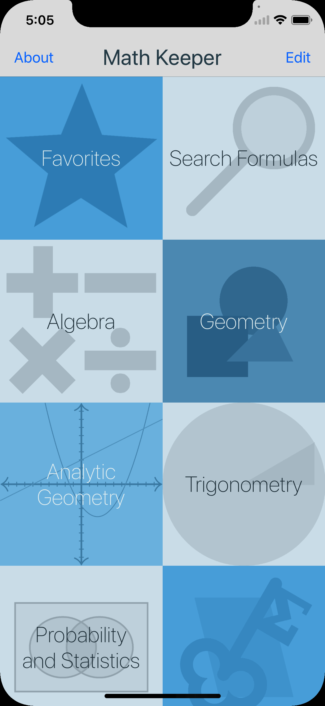
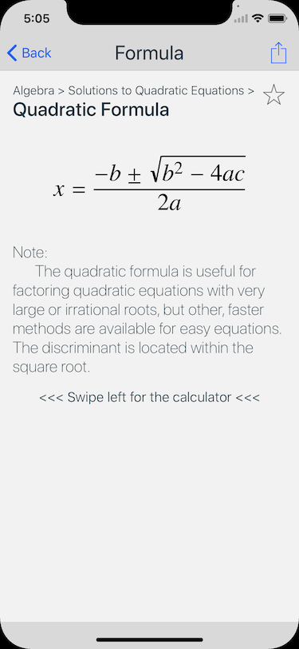
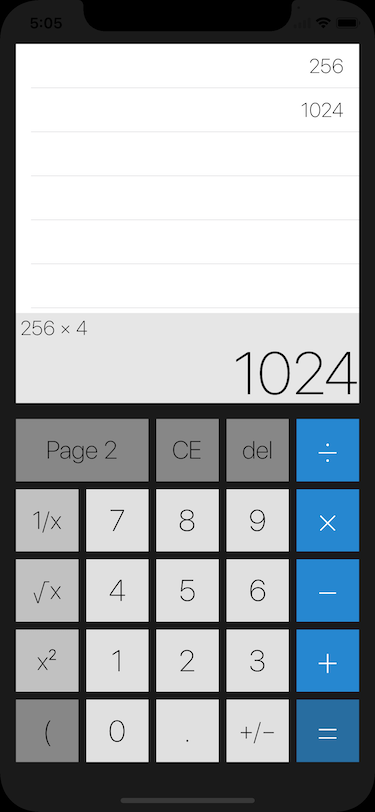

# Math Keeper

Review 100+ math formulas, write notes, calculate solutions, and add your own!

## Description

Math Keeper is a handy reference app for anyone who would like a refreshment of their memory about high school math, or perhaps anyone who would like a refreshment of their memory about what they were supposed to have learned in class yesterday. If you identify with either, you have come to the right place.

The app includes over 100 math formulas for a quick jog of the memory, and you are able to edit them, write notes, and add your own if you so desire. A calculator is also built in for convenience, just one swipe away.

## App Store link

Or direct link: https://apps.apple.com/us/app/math-keeper/id1263494799

## Screenshots

